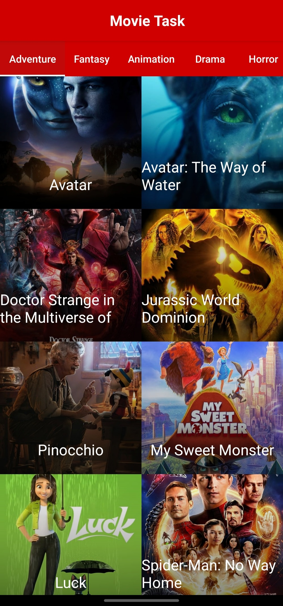
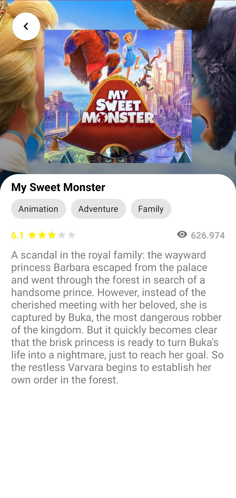

# Movie_App_Task

simple mobile application that connect with Movie Database (TMDB) API.

the app sync Movies from Api and Cache them to Room DB, and invalidate Movies List Cached in DB every 4H,

incase I have already list , will be displayed from DB and incase i opened the app after 4 hours , the cached list should be
deleted and sync again from Api.

 Implemented by the dependencies:
 
 * Kotlin
 * Hilt
 * Coroutine
 * ViewBinding
 * Room dataBase
 * Retrofit
 * Navigation Componenet 
 * project completely architected using MVVM
 
 
 # Screens:
 
  
 
 * Home screen that list movies categorized horizontally
 
 
 
 * Details screen when click on Movie Item, that display required info about the selected Movie

 
